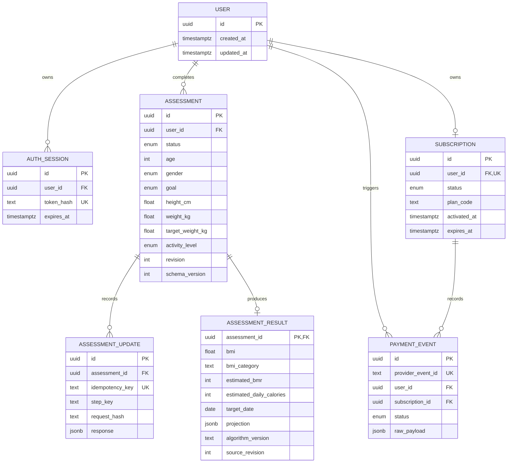

# Database Schema

## 关键约束

- 身高、体重、年龄同时受 API Schema 和 PostgreSQL `CHECK` 约束保护。
- `assessment_updates(assessment_id, idempotency_key)` 唯一，保证步骤请求可安全重放。
- `payment_events.provider_event_id` 全局唯一，保证支付事件可安全重放。
- `assessments.revision` 用于乐观并发控制；冲突返回 409，不做静默覆盖。
- `assessment_results.source_revision` 和 `algorithm_version` 让历史结果可以复现。
- Session 只存 HMAC-SHA256 哈希，不保存原始访问令牌。
